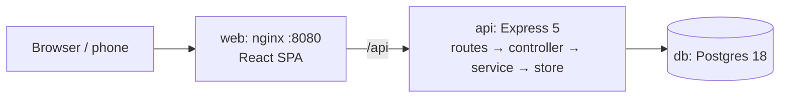
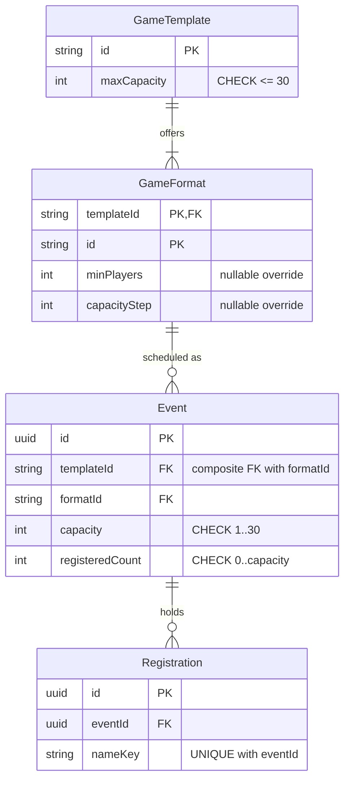

# Tabletop event calendar

A small web app for a store that runs organized play. Organizers create events from game templates (Magic: The Gathering, Pokémon TCG, One Piece Card Game), see them on a calendar and download an `.ics` invite. Each event page shows a QR code for its registration link, and the server enforces capacity in a database transaction.

## Run it

`docker compose up --build`, then open http://localhost:8080. Demo events are seeded. `docker compose down -v` resets everything. From a clone, tests and dev mode first need `cp .env.example .env && npm ci && npm run db:generate && docker compose up -d db`. Then `npm run verify` runs typecheck, lint and tests, and `npm run db:migrate && npm run db:seed && npm run dev` serves the app on :5173.

## Scan from a phone

- Open the app at `http://<LAN-IP>:8080` on the computer. Find the IP with `ipconfig getifaddr en0` (macOS) or `hostname -I` (Linux).
- Or set `PUBLIC_WEB_URL=http://<LAN-IP>:8080` in `.env` and run `docker compose up -d`.
- The phone must be on the same Wi-Fi. Guest networks may isolate clients, and macOS may prompt to allow Docker connections.
- The API runs in a container and can't see the host's LAN IP, so it can't choose the address itself.

## Architecture

## Cut list

- No roster: with no auth it would be public. A consequence I accepted: `ALREADY_REGISTERED` lets anyone check whether a name is registered.
- No waitlist, editing or cancelling
- No phone tunnel
- One store time zone (the browser's); UTC stored
- Seed isn't atomic; a crash midway leaves partial demo data
- No template admin UI
- No live seat counts, pagination or rate limiting
- No browser E2E tests; accessibility is WCAG 2.2 AA basics

## AI tooling

`.claude/` holds the agents, skills and hooks used to build this; `docs/DECISIONS.md` and `docs/AI-LOG.md` are the decision and correction logs.
The `reviewed/*` git tags mark the commits the human read.

## Design write-up

<!-- AUTHOR: human writes this section -->

## AI usage

<!-- AUTHOR: human writes this section -->
