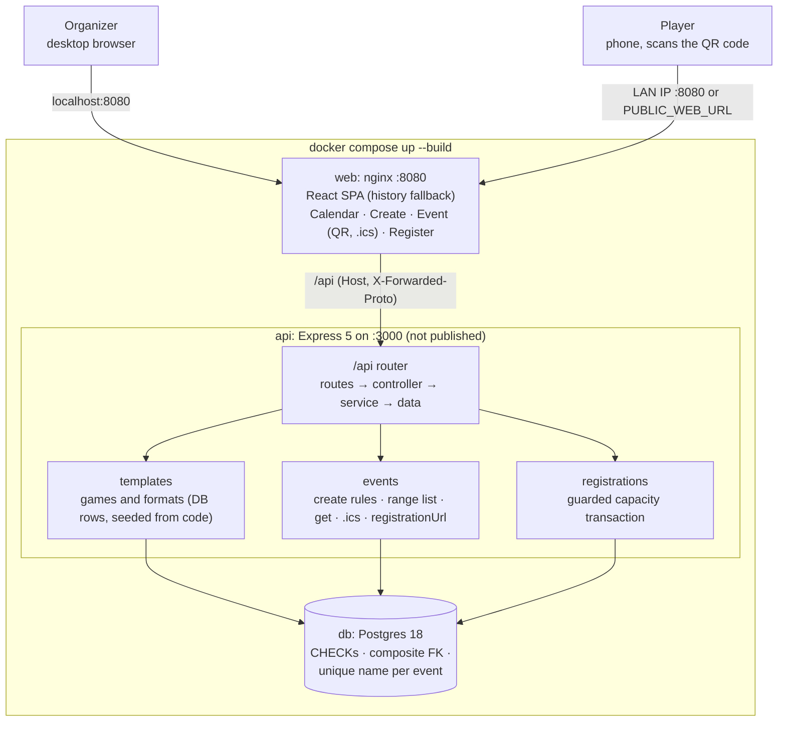
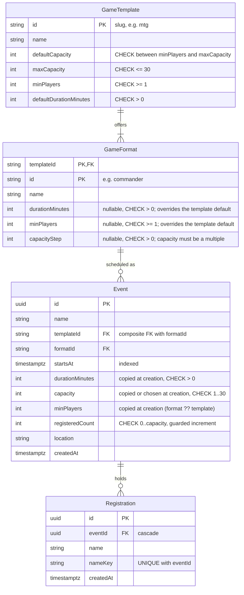

# Architecture: Event Calendar for Tabletop Game Events

Written at G0 with the human, 2026-10-02. The requirements are in `docs/SPEC.md` (local only). Every AC traces to a spec line or a named human decision (DECISIONS.md, `Source: human`). **Scope is these ACs and nothing else.**

## Acceptance criteria

| AC | Criterion | Traces to |
|---|---|---|
| AC-1 | **Create event.** Fields: name, game (template), format, start, capacity and location. The form uses `<input type="date">` whose `min` (and default) is the first local date that still has a start slot: today, or tomorrow after 11:45 PM ("today" is the browser's local date) and a `<select>` of start times in **15-minute steps from 10:00 AM to 11:45 PM** together inside a `fieldset`/`legend`. For today, past slots are hidden. The default time is the first available slot at or after 6:00 PM, otherwise the first available slot; if today has no slots left, the default date is tomorrow (all derived during render). The slots come from a 3-line loop with no date-time library. The client sends ISO UTC built with `` new Date(`${date}T${time}`) ``. Capacity defaults to the format's default (else the template's) and resets when the format changes, and its `min`, `max` and `step` come from the template and format. Location is required and prefilled from `DEFAULT_LOCATION` in `packages/shared`. Success navigates to the event page. | Spec 1, 2; human (UX) |
| AC-2 | **No past events.** The server returns 400 `VALIDATION_FAILED` on `startsAt` when it's not after now. `startsAt` must carry an offset and fall on a 15-minute boundary. | Human (correctness) |
| AC-3 | **Templates.** There are three live games: Magic: The Gathering, Pokémon TCG and One Piece Card Game (values below). Each template drives formats, default duration, default capacity, max capacity and min players. A format may override the duration, the min players and the default capacity (the form's capacity resets when the format changes), and may set `capacityStep`: MTG Booster Draft needs 8 players while the other MTG formats need 4, and Commander uses step 4. A valid capacity is a multiple of the step between the format's min players and the template's max, so Commander allows 4–28 and the others allow up to 30. The event page shows "Needs N more players to start" while `registeredCount < minPlayers`. **Euchre is a test-only fixture** (min 8, max 28, step 4), upserted through the same seed function, and it proves a 4th, non-card game needs zero core changes. No core code branches on a game id. | Spec 2; human |
| AC-4 | **Calendar.** FullCalendar 6 shows the month grid with `fixedWeekCount={false}`, fixed-height cells (`aspectRatio`, never `height="auto"` in month view), `dayMaxEvents` set to true (for "+N more") and single-line chips (`white-space: nowrap`, truncated). A `listMonth` view is available from the toolbar and is the initial view under 768px; the list view may use auto height. Event chips are real links to `/events/:id`. The visible range drives `GET /api/events?from&to`. **No DOM patching of FullCalendar.** | Spec 3; human (UI) |
| AC-5 | **Calendar invite.** `GET /api/events/:id/invite.ics` is generated by the `ics` library. It has UTC `DTSTART`/`DTEND` (start + `durationMinutes`), `SUMMARY` set to the event name, `LOCATION`, `Content-Type: text/calendar; charset=utf-8` and `Content-Disposition: attachment; filename="<slug>.ics"`, where the slug is `[a-z0-9]+` runs joined by `-` (fallback `event`), so non-ASCII names never break the header. `uid` is the event id, so a re-import updates instead of duplicating. The event page links to it. | Spec 4 |
| AC-6 | **QR and registration link.** The API returns `registrationUrl`, which is `PUBLIC_WEB_URL` if set, otherwise the request origin (`trust proxy` 1, `req.protocol` + `req.host`), followed by `/events/:id/register`. The event page renders it with `qrcode.react` (`QRCodeSVG`), with a `title` and the visible URL as a link. The QR code, URL and Register link show **only while registration is open**; when full or closed, a plain-text message in their place explains why (human, G2). When `registrationUrl` points at `localhost` or `127.0.0.1`, a one-line notice under the QR code says phones can't open it and points to the README. The README's "Scan from a phone" section covers two options: open the app at `http://<LAN-IP>:8080`, or set `PUBLIC_WEB_URL` in `.env`. It also gives the commands to find the LAN IP and the gotchas (same Wi-Fi, guest-network isolation, the macOS firewall prompt). The API can't discover the host's LAN IP from inside its container. | Spec 5; human |
| AC-7 | **Capacity is enforced on the server.** One transaction runs a guarded increment and then the insert (see Invariants). Once full, the API returns 409 `EVENT_FULL` with a clear message. With 50 concurrent distinct names on a 30-seat event, exactly 30 succeed. | Spec 5; rubric (correctness) |
| AC-8 | **Duplicate registration.** Names are unique per event after normalization (`nameKey` is the name after NFKC normalization, trimming, whitespace collapsing and lowercasing). A duplicate gets 409 `ALREADY_REGISTERED`, which **wins over** `REGISTRATION_CLOSED` and `EVENT_FULL`. | Rubric (correctness); human |
| AC-9 | **Registration closes at start.** At or after `startsAt`, the API returns 409 `REGISTRATION_CLOSED`, and the register and event pages show a closed state with no form. | Human (correctness) |
| AC-10 | **Full state.** The register page shows "This event is full" **instead of** the form, and the event page shows "Full · n/n". Calendar chips say "Full" in text. A player who loses the race on submit sees the same full state. | Spec 5 ("clear message") |
| AC-11 | **Not found and titles.** There's a 404 route for unknown paths, and an unknown or non-UUID event id gives 404 (never 500) on GET, register and `.ics`, with a not-found page state. Every route sets a `<title>`. | Human (cheap completeness) |
| AC-12 | **No roster, by choice.** There's no auth, so any registrant list would be public. The README says so, and also states the accepted tradeoff: `ALREADY_REGISTERED` lets anyone check whether a name is registered. That's a consequence of having no authentication in scope; with an authenticated user, the duplicate check would only reveal the user's own registration. | Human (privacy) |
| AC-13 | **Accessibility scope** (WCAG 2.2 AA basics, native first). **In:** labels; inline errors with `aria-invalid`/`aria-describedby`; one h1 and a `<title>` per page; native `disabled` while a request is pending; a `fieldset` for date and time; a state replaces any action that can't succeed; the QR code has a `title` plus the visible URL; status shown in text, not color; everything reachable by keyboard; one axe check per page; `color-scheme: light` with an explicit body background and text color. **Out:** error summaries, live regions, focus choreography after a refetch, popover focus patches, theme contrast tests, FullCalendar's internal grid semantics. | Human |
| AC-14 | **One-command run.** `docker compose up --build` runs migrations and `db:seed` before the API starts. The seed **always upserts the templates**. It inserts demo events **only when the events table is empty**, and never updates `registeredCount`. The demo events are day offsets from today at a fixed UTC hour on the 15-minute grid. The one full event is inserted together with its registration rows, so I3 holds. `npm run db:seed` runs the same seed in development. | Deliverable 2; human |
| AC-15 | **Docs.** The README is about 1,000 words or fewer. **The human writes** the design write-up (about 650 words or fewer, answering the spec's three questions) and the AI note (3–5 sentences, including a rejection the human made at a gate). The README also has the cut list, the "Scan from a phone" section (AC-6), the roster note, and a short pointer to the AI tooling (no diagrams; human, G5). No `AUTHOR:` or `TODO` is left anywhere. | Deliverable 2 |
| AC-16 | **History.** There's no target count. Every subject names the specific change, and each slice carries its tests. `main` is linear (cherry-picked), with no merge, `fixup!` or log-only commits. Ranges the human reviewed get annotated `reviewed/<gate>` tags at ship. | Rubric (judgment) |

## System overview

Both apps import the zod contract in `packages/shared`, so request and response shapes are validated the same way on both sides.

## Domain model

- **Snapshot.** At creation the event copies `durationMinutes` (format ?? template), `minPlayers` (format ?? template), and `capacity` (input ?? template default). Later template edits never change an existing event. The template and format names stay linked through the FK.
- **Counter vs `COUNT(*)`.** `registeredCount` is the row that gets locked. The guarded increment serializes the last seat on one row, with no table scan and no SERIALIZABLE retries.
- **Templates are real rows.** The runtime reads only the database. `apps/api/src/templates/definitions.ts` is the **seed**, upserted at boot by the same function the Euchre test uses. That function rejects a definition whose `defaultCapacity` is below one of its formats' effective min players, or isn't a multiple of that format's `capacityStep`, so a bad 4th game fails at seed time, not on a user's form. The form's capacity `min` is the effective min players rounded up to the step, and its `max` is the template's max rounded down to the step.
- **Derived, never stored:** `endsAt` = `startsAt + durationMinutes`, and `registrationStatus`, which is `closed` if `startsAt ≤ now`, else `full` if `registeredCount ≥ capacity`, else `open`.

### Templates (seed values)

| Game (`id`) | Formats (minutes; step) | Default capacity | Min players | Max capacity | Default duration |
|---|---|---|---|---|---|
| Magic: The Gathering (`mtg`) | Standard, Modern (default 12), Commander (step 4, so 4–28; default 12), Booster Draft (240; min 8; default 8) | 16 | 4 | 30 | 180 |
| Pokémon TCG (`pokemon`) | Standard, Expanded (default 16) | 24 | 4 | 30 | 150 |
| One Piece Card Game (`one-piece`) | Standard | 12 | 6 | 24 | 120 |
| *Euchre (test fixture only)* | Tournament (step 4) | 16 | 8 | 28 | 120 |

## Invariants and enforcement

| # | Invariant | Enforced by | When two requests interleave |
|---|---|---|---|
| I1 | `registeredCount ≤ capacity` (no oversell) | A guarded `updateMany` where `id = :id AND startsAt > now AND registeredCount < capacity`, with `registeredCount: { increment: 1 }`, inside `$transaction({ isolationLevel: ReadCommitted })`. The CHECK is the backstop. | The second UPDATE blocks on the row lock. After the first commits, Postgres re-evaluates the WHERE, matches 0 rows, and the request gets 409 `EVENT_FULL`. |
| I2 | One registration per normalized name per event | UNIQUE `(eventId, nameKey)`. The insert runs after the increment in the same transaction. P2002 on that index → `ALREADY_REGISTERED`, and the rollback undoes the increment. | The second transaction waits on the row lock, increments, then fails on the unique index and rolls back. No increment leaks. |
| I3 | `registeredCount` = number of registration rows | One write path (I1 and I2 in a single transaction). There's no delete endpoint (cancelling is a non-goal). | Covered by the concurrency tests, which assert the count equals the rows. |
| I4 | A format belongs to its game | Composite FK `(templateId, formatId)` → `GameFormat`, plus a service check that gives the 400 on `formatId`. | N/A (template rows are read-only at runtime) |
| I5 | Capacity is within `[effective minPlayers, maxCapacity]` and a multiple of the format's `capacityStep` | A service check at creation (400 on `capacity`); the DB also enforces `CHECK capacity BETWEEN 1 AND 30` | N/A (templates are read-only at runtime) |
| I6 | No registration at or after start | The `startsAt > now` clause in the same guarded UPDATE | Atomic with I1 |

**Precedence when the guarded UPDATE matches 0 rows:** 404 (no event) → `ALREADY_REGISTERED` (that `nameKey` exists) → `REGISTRATION_CLOSED` (`startsAt ≤ now`) → `EVENT_FULL`.

**Rules:**
- Never read then write.
- `now` comes from an injected clock in the composition root.
- The transaction `timeout`/`maxWait` and the pg pool are sized so the 50-request test never times out.
- DECISIONS must state that removing the guard makes the concurrency test fail, and we check that it does.
- A CHECK violation (SQLSTATE 23514) is **never** mapped to a 409; it stays a 500, so test 1's "zero 500s" proves the guard rather than the backstop.

## Extension points

**Adding a 4th game** means appending one typed `TemplateDefinition` to `apps/api/src/templates/definitions.ts`. It's upserted at boot, and nothing else changes: not the routes, the services, the schema or the web app (which reads `GET /api/templates`). A game that needs a **new kind of rule** (teams, say) needs a new nullable rule column and one generic check in the create service. The README says so.

**The proof is the Euchre test.** It upserts the Euchre fixture through the same seed function, creates an event, and shows that a capacity that isn't a multiple of 4 is rejected and a valid one fills to capacity, with no game id anywhere in core code.

## API contract

Base path `/api`. JSON in and out. Every error is `{ error: { code, message, details? } }`. The schemas live in `packages/shared`, with human-readable zod messages (never "Too small: expected string…").

| Method and path | Request | Success | Errors |
|---|---|---|---|
| `GET /health` | | 200 `{ ok: true }` | |
| `GET /templates` | | 200 `Template[]`, each with `formats[]` | |
| `GET /events?from&to` | ISO with offset, `from < to` | 200 `EventSummary[]` sorted by `startsAt`: `{ id, name, templateName, formatName, startsAt, endsAt, capacity, registeredCount, registrationStatus }` | 400 |
| `POST /events` | `{ name, templateId, formatId, startsAt, capacity?, location }` | 201 `EventDetail` | 400 `VALIDATION_FAILED` |
| `GET /events/:id` | | 200 `EventDetail` = summary + `{ templateId, formatId, location, minPlayers, durationMinutes, registrationUrl }` | 404 |
| `GET /events/:id/invite.ics` | | 200 `text/calendar` attachment | 404 |
| `POST /events/:id/registrations` | `{ name }` (1–60 characters after trimming) | 201 `{ id, name }` | 400, 404, 409 `ALREADY_REGISTERED` / `REGISTRATION_CLOSED` / `EVENT_FULL` |

**Error codes and status:**

| Code | Status |
|---|---|
| `VALIDATION_FAILED` | 400. `details` = `{ formErrors, fieldErrors }`, and field errors land on the field the user can change. |
| `BAD_REQUEST` | Keeps the body-parser status: malformed JSON → 400, a `latin1` charset → 415, an oversized body → 413. |
| `NOT_FOUND` | 404, for unknown `/api` routes and unknown or non-UUID ids. |
| `ALREADY_REGISTERED`, `REGISTRATION_CLOSED`, `EVENT_FULL` | 409 |
| `INTERNAL` | 500, with no internals in the message. |

**Validation inside `POST /events`:** an unknown `templateId`, a foreign `formatId`, capacity outside the bounds or off the step, `startsAt` in the past, off the 15-minute grid or missing an offset, and a blank name or location each give 400 `VALIDATION_FAILED` on that field.

**Precedence:** 400 (body; no database) → 404 (unknown or non-UUID id, never 400) → the 409s in the order under Invariants.

## Frontend

React 19 SPA (Vite) with React Router 7.18.4 in **data mode** (`createBrowserRouter`). There are **no loaders or actions**: TanStack Query owns all server state through `queryOptions` factories, and every response is parsed with the shared schemas. There's an `errorElement` and a catch-all route. Each page renders React 19's `<title>`. `react-router-dom` is banned. Tailwind defaults plus a few tokens, ≤ 40 lines of CSS.

| Route | Content | States |
|---|---|---|
| `/` | FullCalendar (AC-4) and a "New event" link | loading, error with retry, empty month |
| `/events/new` | The create form (AC-1). Changing the game resets the dependent fields with a `key` rather than an Effect. | templates loading or failing, pending (disabled "Creating…"), server field errors |
| `/events/:id` | Name; game and format; local start–end; location; "n/cap registered" or "Full · n/n"; "Needs N more players to start"; the QR code and URL; "Download calendar invite (.ics)" | loading, not found, error, open, full, closed |
| `/events/:id/register` | An event summary and a name form | loading, not found, open, full (no form), closed (no form), pending, `ALREADY_REGISTERED` on the name field, `EVENT_FULL` race → full state, success confirmation with the `.ics` link |
| `*` | Not found | |

**Accessibility scope:** AC-13.

## Containers

- **db:** `postgres:18-alpine` with a named volume and a `pg_isready` healthcheck, on **`127.0.0.1:${DB_PORT:-5433}:5432`**. The test database is created by the test global setup, not by an init script.
- **api:** multi-stage `node:24-alpine` with an exec-form entrypoint (`prisma migrate deploy` → seed → `exec node`), `init: true` and `depends_on: db (service_healthy)`. It isn't published. Its env is `DATABASE_URL`, `PUBLIC_WEB_URL` (optional) and `PORT=3000`.
- **web:** a Vite build served by `nginx:stable-alpine` on **8080 (all interfaces, so a phone on the LAN can reach it)**. The image installs only the web and shared workspaces. nginx has a history fallback, proxies `/api` with `Host $http_host` and `X-Forwarded-Proto`, and uses `resolver 127.0.0.11 valid=10s` with a variable `proxy_pass`.
- **Development:** `npm run dev` runs the api (tsx watch on :3000) and Vite on :5173, which proxies `/api`. There are no optional services.

## Testing (write exactly these; justify any extra in DECISIONS)

**API** (backend-engineer; supertest against the real `TEST_DATABASE_URL`; one assertion lives in one place):
1. **Concurrency:** 50 distinct names on a 30-seat event → 30 × 201, 20 × `EVENT_FULL`, zero 500s, 30 rows, `registeredCount` 30.
2. **Concurrent duplicates:** the same name × 10 in case and space variants → 1 × 201, 9 × `ALREADY_REGISTERED`, no leaked increment.
3. **Full and duplicate precedence:** a new name on a full event → `EVENT_FULL`, and a duplicate on a full event → `ALREADY_REGISTERED`.
4. **Closed:** registering at or after `startsAt` (injected clock) → `REGISTRATION_CLOSED`.
5. **Templates:** defaults applied, the format overrides (Booster Draft: 240 minutes and min 8, vs the defaults of 180 and 4), min and max enforced including Commander's step-rounded 28, and a foreign format rejected by both the service and the composite FK.
6. **Extensibility:** the Euchre fixture is seeded through the same upsert, its step rule is enforced, and it fills, with no core code changes; the upsert rejects a definition whose default capacity is off its step.
7. **Create validation** (`it.each`): an unknown game, capacity 31, a past `startsAt`, a `startsAt` off the 15-minute grid, a blank name, a `startsAt` with no offset.
8. **`.ics`:** UTC `DTSTART`/`DTEND`, `SUMMARY`, `LOCATION`, `UID`, the content type and the attachment disposition, including an emoji-named event.
9. **Error classes** (`it.each`): malformed JSON → 400, a `latin1` charset → 415, oversized → 413, an unknown route → 404, and an unknown or non-UUID id on GET, register and `.ics` → 404. All return the envelope.
10. **DB backstop:** the CHECK rejects `registeredCount > capacity` written as raw SQL.
11. **`registrationUrl`** (`it.each`): with `X-Forwarded-Proto: https` and `Host: 192.168.1.5:8080` it is `https://192.168.1.5:8080/events/:id/register`; with `PUBLIC_WEB_URL` set, the env value wins. (Added at G0 so AC-6 has a proving test.)

**Web** (frontend-engineer; Testing Library and jsdom with mocked `fetch`; one axe check per page, inside these tests):
1. The API client parses a success response and maps the error envelope.
2. Create: picking a game sets the formats, the default capacity and its bounds.
3. Create: today hides past slots, the default slot follows the clock (19:05 → 7:15 PM; 23:50 → tomorrow at 6:00 PM), and the payload is the correct ISO UTC.
4. Create: a server 400 lands on the right field.
5. Register (`it.each` over full and closed): those states render no form; a 409 `EVENT_FULL` on submit shows the full state; `ALREADY_REGISTERED` shows a name error; success shows the confirmation.
6. The event page shows the QR code with `registrationUrl`, the `.ics` link and the min-players hint, the localhost notice only when `registrationUrl` is localhost, plus one axe check.
7. The calendar requests the visible range, and full events say "Full" in text.

**Runner rules:** the root `vitest` projects are `apps/api` and `apps/web` (shared has no tests of its own). Each project's `include` matches where its tests live, and there's no `passWithNoTests`. The API project sets `fileParallelism: false`. Its global setup (counted in the API test budget) creates the database if missing, runs `migrate deploy`, empties it and upserts the real template definitions once; only the Euchre test upserts Euchre.

## Budgets (the gate-reviewer enforces these with `wc -l`)

| Area | Source LOC | Test LOC |
|---|--:|--:|
| `apps/api` (src + prisma seed; schema and migration excluded) | ≤ 700 | ≤ 500 |
| `apps/web/src` | ≤ 900 | ≤ 350 |
| CSS | ≤ 40 | — |
| `packages/shared` | ≤ 150 | — |
| Infra (Dockerfiles, compose, nginx, entrypoint) | ≤ 200 | — |
| README | ≤ ~1,000 words (write-up ≤ ~650) | — |

## Dependency manifest (pinned 2026-09-29, lint 2026-10-01; install exactly these)

| Package | Version | Note |
|---|---|---|
| `prisma`, `@prisma/client`, `@prisma/adapter-pg` | 7.10.0 | `prisma@latest` is an 8.0 RC |
| `pg` / `@types/pg` | 8.23.0 / 8.23.1 | |
| `express` / `@types/express` | 5.2.1 / 5.0.6 | |
| `zod` | 4.6.5 | Shared contract |
| `ics` | 3.12.0 | |
| `react`, `react-dom` / `@types/react`, `@types/react-dom` | 19.3.0 | |
| `react-router` | 7.18.4 | Data mode; no `react-router-dom` |
| `@tanstack/react-query` | 5.104.0 | |
| `@fullcalendar/react`, `core`, `daygrid`, `list` | 6.1.21 | Stay on 6 |
| `qrcode.react` | 4.2.0 | |
| `vite` / `@vitejs/plugin-react` | 8.3.1 / 6.1.1 | |
| `tailwindcss`, `@tailwindcss/vite` | 4.3.3 | |
| `typescript` | 6.0.3 | typescript-eslint needs `<6.1` |
| `tsx` | 4.23.15 | API dev runner and seed |
| `vitest` / `supertest` / `@types/supertest` | 5.0.2 / 7.3.0 / 7.2.1 | |
| `@testing-library/react` / `@testing-library/dom` / `jsdom` / `axe-core` | 16.3.3 / 10.4.2 / 30.1.1 / 4.13.0 | |
| `@types/node` | 24.19.0 | |
| `eslint` / `@eslint/js` / `typescript-eslint` / `eslint-plugin-react-hooks` / `@tanstack/eslint-plugin-query` | 10.11.0 / 10.0.1 / 8.71.0 / 7.1.1 / 5.104.0 | Lint |

Any other dependency needs a DECISIONS row, and only the lead installs it.

## Pitfalls written in as rules

1. **Duplicate before full:** a registered player re-registering on a full event gets `ALREADY_REGISTERED`, never `EVENT_FULL` (AC-8, API test 3).
2. **The concurrency test must be falsifiable.** DECISIONS states that removing the guard makes it fail.
3. **Times:**
   - start times fall on 15-minute boundaries
   - `` new Date(`${date}T${time}`) `` converts local time to UTC
   - "today" is the browser's local date, not the UTC date
   - seed times are relative to now and valid across DST
   - the server only accepts ISO strings with an offset
   - the `.ics` is in UTC
4. **Calendar:** `fixedWeekCount={false}`, a fixed `aspectRatio`, `dayMaxEvents`, nowrap chips, `listMonth`, and no DOM patching. Avoid a `datesSet` → `setState` loop by comparing the range before setting it.
5. **Explicit light color scheme:** `color-scheme: light` plus a body background and text color.
6. **Validation messages:** human-readable zod messages, and server field errors land on the field the user can change.
7. **The test runner actually runs the tests** (see Runner rules).
8. **Non-UUID ids return 404, never 500,** on GET, register and `.ics`.
9. **Prisma transaction timeouts** and the pg pool are sized for the 50-request concurrency test.
10. **Prisma 7 and CHECKs:** the CHECK constraints are hand-written SQL in the migration. Tests use `migrate deploy`, **never `db push`**, which would silently skip them.
11. **Libraries, not hand-rolled:** `.ics` comes from `ics` and the QR code from `qrcode.react`.
12. **Origin:** the Vite dev proxy keeps `Host` (no `changeOrigin`), and nginx forwards `Host $http_host` and `X-Forwarded-Proto`, or the QR code encodes an unreachable address.
13. **Web tests against FullCalendar** assert in the `listMonth` view, because jsdom has no layout and the month grid may collapse chips into "+N more".

## Work breakdown

- **Phase 0 (lead):**
  - npm workspaces, root and workspace scripts (`build`, `start`, `dev`, `db:generate`, `db:migrate`, `db:seed`, `typecheck`, `lint`, `test`, `verify`), tsconfig, eslint (from the template) and Vitest projects
  - `apps/api/prisma.config.ts` (Prisma 7; owned by the lead)
  - `.env.example` and `.env`
  - the full manifest, installed
  - `packages/shared`: the contract and every error code
  - the Prisma schema, the migration with its CHECKs, and the composite FK
  - a compose file with only `db`
  - a test global setup that creates, migrates and empties the per-worktree database
  - the API skeleton: config, clock, `trust proxy`, error handler, 404, health
  - the web skeleton: router, titles, query client, API client stub
  - one smoke test, and `verify` green → **G1**
- **Phase 1 (parallel):**
  - **backend-engineer** (`apps/api/**` except lead and infra files): AC-2, AC-3 (API side), AC-5, AC-6 (`registrationUrl`), AC-7, AC-8, AC-9, AC-11 (API), AC-14 (seed), and API tests 1–11
  - **frontend-engineer** (`apps/web/**` except infra files): AC-1, AC-3 (hint), AC-4, AC-5 (link), AC-6 (QR), AC-8 (name error), AC-9 (closed UI), AC-10, AC-11 (web), AC-13, and web tests 1–7
  - **infra-engineer** (Dockerfiles, compose, nginx, the api entrypoint, `.dockerignore`, `.env.example`; the lead seeds compose and `.env.example` in Phase 0, and infra owns them from Phase 1): AC-14 and the containers above
- **Phase 2–4:** integration, the G3 walkthrough, the final review, and docs (tech-writer facts; the human writes the write-up and the AI note).

## Non-goals and cuts

- **Spec non-goals:** auth, payments, email, recurring events, editing or cancelling events and registrations, admin dashboards.
- **Cut on purpose** (these go in the README cut list):
  - a public roster (AC-12)
  - a waitlist
  - a phone tunnel (we document the LAN IP or `PUBLIC_WEB_URL` instead)
  - per-store time zones (the browser's zone is assumed to be the store's; we store UTC instants)
  - a template admin UI
  - theme and game colors
  - click-to-create on calendar days
  - polling or live seat counts
  - pagination and rate limiting
  - `demo:race` and `lan-url` scripts
  - screenshots
  - browser E2E tests (G3 is a manual pass)
  - a "How this was built" section longer than 2–3 sentences
